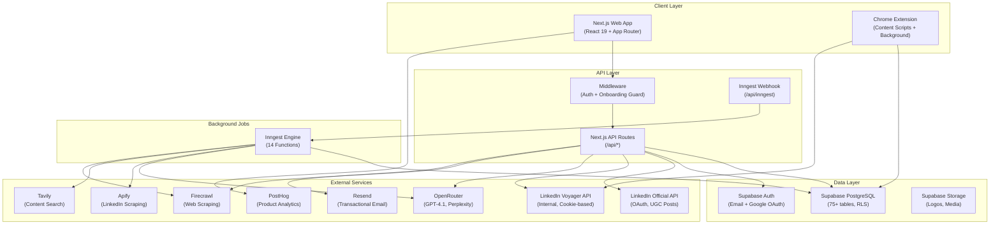
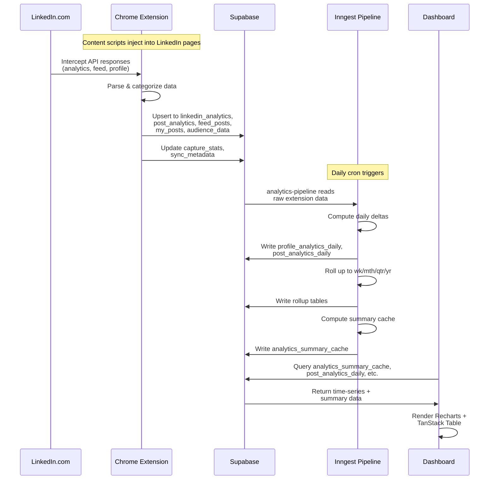
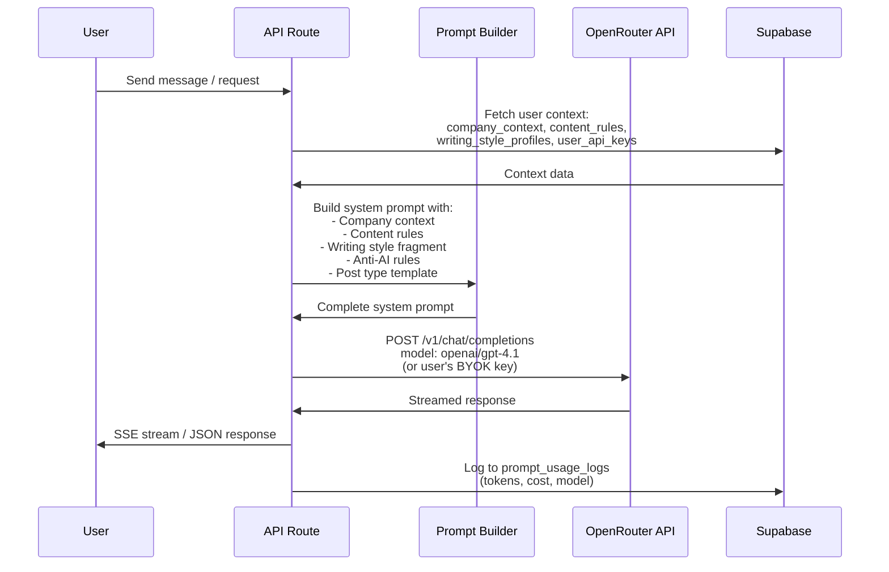
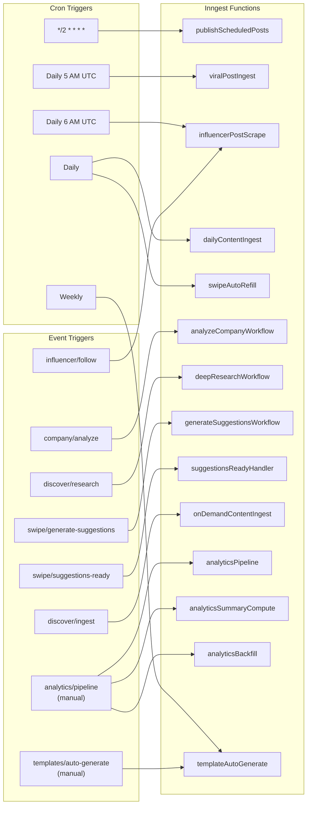
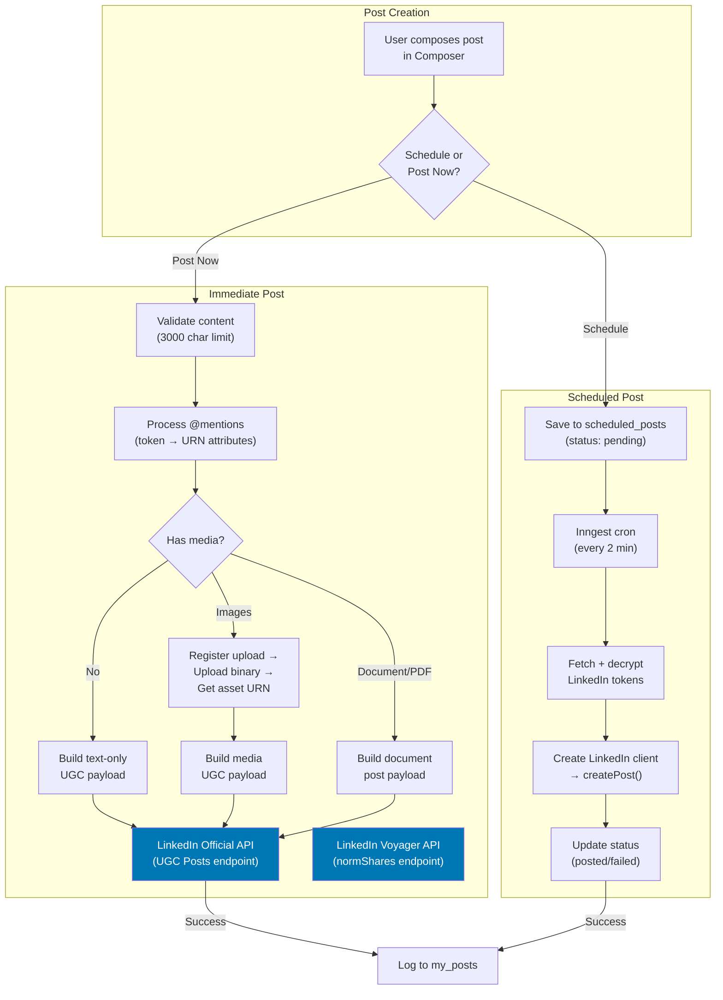
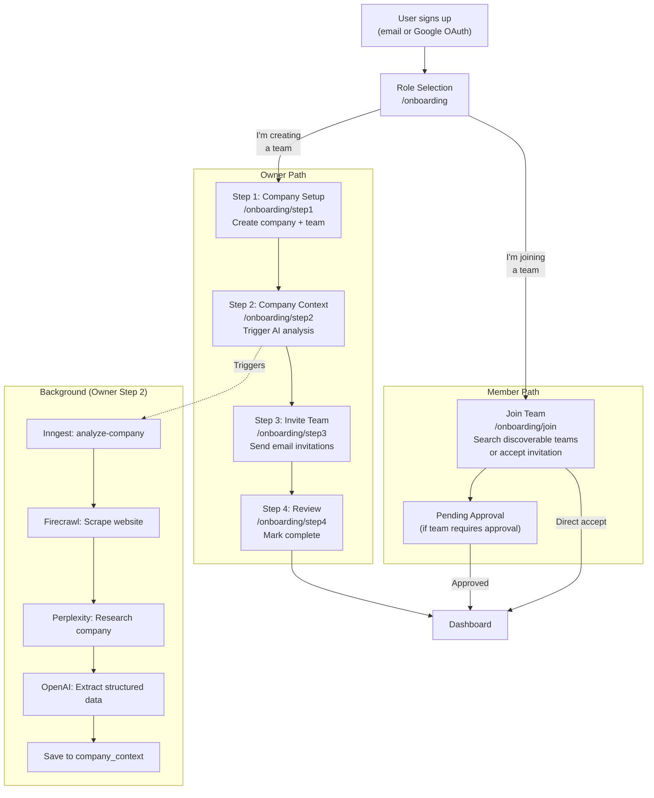
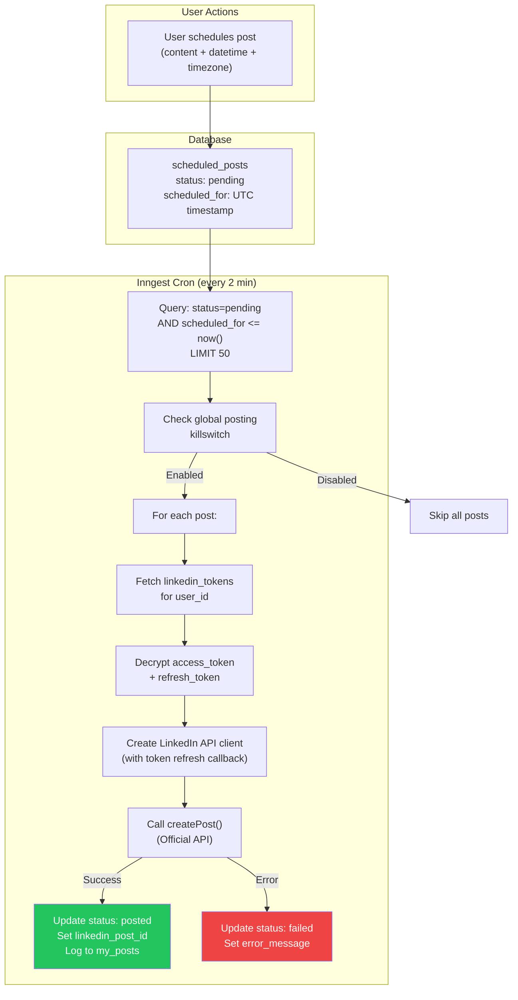
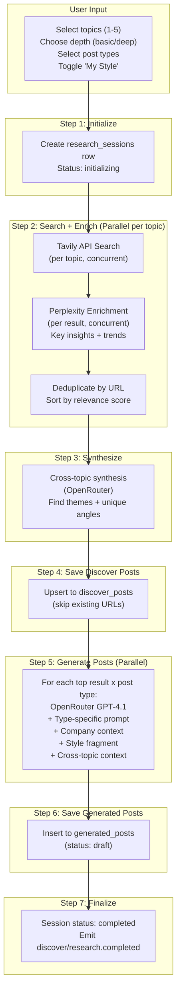

# ChainLinked System Architecture

Technical architecture documentation with Mermaid diagrams.

---

## Overall System Architecture



---

## Data Flow: Extension to Dashboard



---

## AI Pipeline: User Prompt to Response



---

## Inngest Workflow Architecture

All 14 registered Inngest functions and their triggers:



### Function Details

| Function | Trigger | Purpose | Key Tables |
|----------|---------|---------|------------|
| `publishScheduledPosts` | Cron `*/2 * * * *` | Publish pending scheduled posts via LinkedIn API | `scheduled_posts`, `linkedin_tokens`, `my_posts` |
| `viralPostIngest` | Cron daily 5 AM | Scrape viral creators via Apify, quality filter, save | `viral_source_profiles`, `discover_posts` |
| `influencerPostScrape` | Cron daily 6 AM + event | Scrape followed influencers via Apify | `followed_influencers`, `influencer_posts` |
| `dailyContentIngest` | Cron daily | Ingest topic-based content | `discover_posts`, `discover_news_articles` |
| `swipeAutoRefill` | Cron daily | Check user suggestion counts, trigger refills | `generated_suggestions` |
| `analyzeCompanyWorkflow` | Event `company/analyze` | Firecrawl + Perplexity + OpenAI company analysis | `company_context` |
| `deepResearchWorkflow` | Event `discover/research` | Tavily + Perplexity + OpenAI research pipeline | `research_sessions`, `discover_posts`, `generated_posts` |
| `generateSuggestionsWorkflow` | Event `swipe/generate-suggestions` | Generate personalized post suggestions | `generated_suggestions`, `suggestion_generation_runs` |
| `suggestionsReadyHandler` | Event `swipe/suggestions-ready` | Post-generation notification handler | -- |
| `onDemandContentIngest` | Event `discover/ingest` | User-triggered content ingest | `discover_posts` |
| `analyticsPipeline` | Event `analytics/pipeline` | Daily/weekly/monthly analytics rollup | All `post_analytics_*` and `profile_analytics_*` tables |
| `analyticsSummaryCompute` | Chained from pipeline | Pre-compute dashboard summary metrics | `analytics_summary_cache` |
| `analyticsBackfill` | Manual trigger | Backfill historical analytics data | All analytics tables |
| `templateAutoGenerate` | Event `templates/auto-generate` | AI-generate templates for users | `templates` |

---

## LinkedIn Posting Flow



### Dual API Strategy

ChainLinked supports two LinkedIn API paths:

1. **Official API** (`lib/linkedin/post.ts`, `lib/linkedin/api-client.ts`): Uses OAuth 2.0 tokens from `linkedin_tokens`. Supports UGC Posts, media upload, document posts. Used for all scheduled posts and primary posting.

2. **Voyager API** (`lib/linkedin/voyager-post.ts`, `lib/linkedin/voyager-client.ts`): Uses browser cookies from `linkedin_credentials` (li_at, JSESSIONID). Supports posting, editing, deleting, reposting. Used as fallback and for operations not available in the official API. Includes rate limiting, retry logic, and cookie validation.

---

## Onboarding Flow



---

## Scheduling Pipeline Flow



---

## Deep Research Pipeline Flow



---

## Directory Structure Overview

```
ChainLinked/
├── app/
│   ├── api/                    # 30+ API route groups
│   │   ├── ai/                 # AI generation endpoints
│   │   ├── analytics/          # Analytics data endpoints
│   │   ├── auth/               # Authentication callbacks
│   │   ├── brand-kit/          # Brand extraction
│   │   ├── inngest/            # Inngest webhook handler
│   │   ├── linkedin/           # LinkedIn API proxy
│   │   ├── teams/              # Team management
│   │   └── ...
│   ├── dashboard/              # Authenticated app pages
│   │   ├── analytics/
│   │   ├── carousels/
│   │   ├── compose/
│   │   ├── discover/
│   │   ├── drafts/
│   │   ├── inspiration/
│   │   ├── posts/
│   │   ├── prompts/
│   │   ├── schedule/
│   │   ├── settings/
│   │   ├── swipe/
│   │   ├── team/
│   │   └── templates/
│   ├── onboarding/             # Onboarding flow pages
│   ├── login/, signup/         # Auth pages
│   └── invite/                 # Team invitation acceptance
├── components/
│   ├── features/               # Feature-specific components (70+)
│   ├── ui/                     # shadcn/ui primitives
│   └── shared/                 # Reusable components
├── hooks/                      # 50+ custom React hooks
├── lib/
│   ├── ai/                     # OpenRouter client + prompts
│   ├── apify/                  # Apify scraping client
│   ├── auth/                   # Auth utilities
│   ├── firecrawl/              # Brand extraction
│   ├── inngest/                # Background job definitions
│   │   └── functions/          # 14 Inngest functions
│   ├── linkedin/               # LinkedIn API (Official + Voyager)
│   ├── perplexity/             # Perplexity research client
│   ├── research/               # Tavily search client
│   ├── supabase/               # Supabase client setup
│   └── email/                  # Resend email client
├── extension/                  # Chrome extension source
├── types/                      # TypeScript type definitions
├── services/                   # Service layer
└── supabase/
    └── migrations/             # 30+ SQL migrations
```
