# ChainLinked Database Documentation

Supabase PostgreSQL schema documentation. 75+ tables organized by domain.

**Project**: `baurjucvzdboavbcuxjh` | **Region**: `ap-south-1`

---

## Table of Contents

1. [Auth & User Profiles](#1-auth--user-profiles)
2. [Teams & Companies](#2-teams--companies)
3. [LinkedIn Integration](#3-linkedin-integration)
4. [Posts & Scheduling](#4-posts--scheduling)
5. [Analytics (Extension-Captured)](#5-analytics-extension-captured)
6. [Analytics (Inngest-Managed Pipeline)](#6-analytics-inngest-managed-pipeline)
7. [Discover & Content](#7-discover--content)
8. [Swipe & Suggestions](#8-swipe--suggestions)
9. [Research](#9-research)
10. [AI & Prompts](#10-ai--prompts)
11. [Templates & Carousels](#11-templates--carousels)
12. [Brand Kit](#12-brand-kit)
13. [Settings & Configuration](#13-settings--configuration)
14. [Extension Data](#14-extension-data)
15. [Admin](#15-admin)
16. [Relationships](#16-key-relationships)
17. [RLS Policy Summary](#17-rls-policy-summary)
18. [Inngest-Managed Tables](#18-inngest-managed-tables)

---

## 1. Auth & User Profiles

### `profiles`

Core user profile, created automatically via a database trigger on Supabase Auth signup.

| Column | Type | Description |
|--------|------|-------------|
| `id` | uuid (PK) | Matches `auth.users.id` |
| `full_name` | text | Display name |
| `email` | text | Email address |
| `avatar_url` | text | Profile avatar URL |
| `linkedin_access_token` | text | Legacy token field |
| `linkedin_user_id` | text | LinkedIn user ID |
| `linkedin_connected_at` | timestamptz | When LinkedIn was connected |
| `linkedin_token_expires_at` | timestamptz | Token expiry |
| `linkedin_avatar_url` | text | LinkedIn profile picture |
| `linkedin_headline` | text | LinkedIn headline |
| `linkedin_profile_url` | text | LinkedIn profile URL |
| `company_onboarding_completed` | boolean | Owner onboarding status |
| `company_name` | text | Company name from onboarding |
| `company_description` | text | Company description |
| `company_products` | text | Products/services |
| `company_icp` | text | Ideal customer profile |
| `company_value_props` | text | Value propositions |
| `company_website` | text | Company website URL |
| `onboarding_completed` | boolean | Overall onboarding status |
| `onboarding_current_step` | integer | Current onboarding step (1-4) |
| `onboarding_type` | text | `'owner'` or `'member'` |
| `discover_topics_selected` | boolean | Whether user selected topics |
| `discover_topics` | text[] | Selected content topics |
| `dashboard_tour_completed` | boolean | Dashboard walkthrough status |
| `extension_logged_in` | boolean | Extension auth status |
| `extension_last_active_at` | timestamptz | Last extension activity |
| `created_at` | timestamptz | Account creation time |

---

## 2. Teams & Companies

### `companies`

Company entities created during owner onboarding.

| Column | Type | Description |
|--------|------|-------------|
| `id` | uuid (PK) | |
| `name` | text | Company name |
| `slug` | text | URL-safe identifier |
| `description` | text | Company description |
| `website` | text | Company website |
| `logo_url` | text | Company logo |
| `owner_id` | uuid | User who created the company |
| `settings` | jsonb | Company-level settings |
| `created_at` | timestamptz | |
| `updated_at` | timestamptz | |

### `teams`

Teams belong to companies. One company can have multiple teams.

| Column | Type | Description |
|--------|------|-------------|
| `id` | uuid (PK) | |
| `name` | text | Team name |
| `logo_url` | text | Team logo |
| `owner_id` | uuid | Team owner (user ID) |
| `company_id` | uuid (FK) | References `companies.id` |
| `discoverable` | boolean | Whether team appears in search for member onboarding |
| `created_at` | timestamptz | |
| `updated_at` | timestamptz | |

### `team_members`

Junction table for team membership.

| Column | Type | Description |
|--------|------|-------------|
| `id` | uuid (PK) | |
| `team_id` | uuid (FK) | References `teams.id` |
| `user_id` | uuid | User ID |
| `role` | text | `'owner'`, `'admin'`, or `'member'` |
| `joined_at` | timestamptz | |

### `team_invitations`

Email-based team invitations with expiring tokens.

| Column | Type | Description |
|--------|------|-------------|
| `id` | uuid (PK) | |
| `team_id` | uuid (FK) | References `teams.id` |
| `email` | text | Invitee email |
| `role` | text | Role to assign on acceptance |
| `token` | text | Unique invitation token |
| `invited_by` | uuid | User who sent the invitation |
| `status` | text | `'pending'`, `'accepted'`, `'expired'` |
| `expires_at` | timestamptz | Token expiry |
| `created_at` | timestamptz | |
| `accepted_at` | timestamptz | |

### `team_join_requests`

Requests from users wanting to join discoverable teams.

| Column | Type | Description |
|--------|------|-------------|
| `id` | uuid (PK) | |
| `user_id` | uuid | Requesting user |
| `team_id` | uuid (FK) | References `teams.id` |
| `status` | text | `'pending'`, `'approved'`, `'rejected'` |
| `message` | text | User's message |
| `reviewed_by` | uuid | Admin who reviewed |
| `reviewed_at` | timestamptz | |
| `review_note` | text | Reviewer's note |
| `created_at` | timestamptz | |
| `updated_at` | timestamptz | |

### `company_context`

AI-analyzed company data from the onboarding workflow.

| Column | Type | Description |
|--------|------|-------------|
| `id` | uuid (PK) | |
| `user_id` | uuid | |
| `company_name` | text | |
| `website_url` | text | |
| `industry` | text | |
| `target_audience_input` | text | User's raw input |
| `value_proposition` | text | AI-extracted |
| `company_summary` | text | AI-extracted |
| `products_and_services` | jsonb | AI-extracted structured data |
| `target_audience` | jsonb | AI-extracted (industries, roles, pain points) |
| `tone_of_voice` | jsonb | AI-extracted (descriptors, style, examples) |
| `brand_colors` | jsonb | Colors from Firecrawl extraction |
| `scraped_content` | text | Raw Firecrawl HTML |
| `perplexity_research` | text | Raw Perplexity research output |
| `status` | text | `'pending'`, `'analyzing'`, `'completed'`, `'failed'` |
| `error_message` | text | |
| `inngest_run_id` | text | Inngest workflow run ID |
| `created_at` | timestamptz | |
| `updated_at` | timestamptz | |
| `completed_at` | timestamptz | |

---

## 3. LinkedIn Integration

### `linkedin_tokens`

OAuth 2.0 tokens for the LinkedIn Official API. Tokens are encrypted at rest.

| Column | Type | Description |
|--------|------|-------------|
| `id` | uuid (PK) | |
| `user_id` | uuid | |
| `access_token` | text | Encrypted OAuth access token |
| `refresh_token` | text | Encrypted OAuth refresh token |
| `expires_at` | timestamptz | Token expiry |
| `linkedin_urn` | text | User's LinkedIn URN (e.g., `urn:li:person:xxx`) |
| `scopes` | text[] | Granted OAuth scopes |
| `created_at` | timestamptz | |
| `updated_at` | timestamptz | |

### `linkedin_credentials`

Voyager API cookies captured by the Chrome extension.

| Column | Type | Description |
|--------|------|-------------|
| `id` | uuid (PK) | |
| `user_id` | uuid | |
| `li_at` | text | LinkedIn auth cookie |
| `jsessionid` | text | Session cookie |
| `liap` | text | LinkedIn app cookie |
| `csrf_token` | text | CSRF token |
| `user_agent` | text | Browser user agent |
| `cookies_set_at` | timestamptz | When cookies were captured |
| `expires_at` | timestamptz | Estimated cookie expiry |
| `is_valid` | boolean | Validation status |
| `last_used_at` | timestamptz | Last API call time |
| `created_at` | timestamptz | |
| `updated_at` | timestamptz | |

### `linkedin_profiles`

LinkedIn profile data synced by the extension.

| Column | Type | Description |
|--------|------|-------------|
| `id` | uuid (PK) | |
| `user_id` | uuid | |
| `profile_urn` | text | LinkedIn profile URN |
| `public_identifier` | text | Public profile slug |
| `first_name` | text | |
| `last_name` | text | |
| `headline` | text | |
| `location` | text | |
| `industry` | text | |
| `profile_picture_url` | text | |
| `connections_count` | integer | |
| `followers_count` | integer | |
| `summary` | text | About section |
| `raw_data` | jsonb | Full API response |
| `captured_at` | timestamptz | |
| `updated_at` | timestamptz | |

---

## 4. Posts & Scheduling

### `my_posts`

User's own LinkedIn posts. Populated by both the extension (captures) and the scheduler (after posting).

| Column | Type | Description |
|--------|------|-------------|
| `id` | uuid (PK) | |
| `user_id` | uuid | |
| `activity_urn` | text | LinkedIn activity URN |
| `content` | text | Post text content |
| `media_type` | text | `'text'`, `'image'`, `'document'`, etc. |
| `media_urls` | text[] | Attached media URLs |
| `reactions` | integer | Total reactions |
| `comments` | integer | Comment count |
| `reposts` | integer | Repost count |
| `impressions` | integer | View count |
| `saves` | integer | Save count |
| `sends` | integer | Share/send count |
| `unique_views` | integer | Unique viewer count |
| `engagement_rate` | numeric | Calculated engagement rate |
| `source` | text | `'extension'`, `'scheduled'`, `'direct'` |
| `posted_at` | timestamptz | When posted on LinkedIn |
| `raw_data` | jsonb | Full API response |
| `created_at` | timestamptz | |
| `updated_at` | timestamptz | |

### `scheduled_posts`

Queue of posts scheduled for future publication.

| Column | Type | Description |
|--------|------|-------------|
| `id` | uuid (PK) | |
| `user_id` | uuid | |
| `content` | text | Post content |
| `scheduled_for` | timestamptz | UTC publish time |
| `timezone` | text | User's timezone for display |
| `status` | text | `'pending'`, `'posting'`, `'posted'`, `'failed'` |
| `visibility` | text | `'PUBLIC'`, `'CONNECTIONS'` |
| `media_urls` | text[] | Attached media |
| `linkedin_post_id` | text | URN after posting |
| `activity_urn` | text | Activity URN after posting |
| `posted_at` | timestamptz | Actual post time |
| `error_message` | text | Failure reason |
| `created_at` | timestamptz | |
| `updated_at` | timestamptz | |

### `compose_conversations`

Auto-saved composer state and AI chat history.

| Column | Type | Description |
|--------|------|-------------|
| `id` | uuid (PK) | |
| `user_id` | uuid | |
| `mode` | text | Compose mode (write, ai-chat, etc.) |
| `title` | text | Conversation title |
| `messages` | jsonb | Chat message history |
| `tone` | text | Selected tone |
| `is_active` | boolean | Active conversation flag |
| `created_at` | timestamptz | |
| `updated_at` | timestamptz | |

### `posting_goals`

User-defined posting frequency targets.

| Column | Type | Description |
|--------|------|-------------|
| `id` | uuid (PK) | |
| `user_id` | uuid | |
| `period` | text | `'daily'`, `'weekly'`, `'monthly'` |
| `target_posts` | integer | Goal post count |
| `current_posts` | integer | Current progress |
| `start_date` | date | Period start |
| `end_date` | date | Period end |
| `created_at` | timestamptz | |
| `updated_at` | timestamptz | |

---

## 5. Analytics (Extension-Captured)

These tables are populated directly by the Chrome extension.

### `linkedin_analytics`

Raw analytics page snapshots.

| Column | Type | Description |
|--------|------|-------------|
| `id` | uuid (PK) | |
| `user_id` | uuid | |
| `page_type` | text | Analytics page type |
| `impressions` | integer | |
| `members_reached` | integer | |
| `engagements` | integer | |
| `new_followers` | integer | |
| `profile_views` | integer | |
| `search_appearances` | integer | |
| `top_posts` | jsonb | Top performing posts data |
| `raw_data` | jsonb | Full captured data |
| `captured_at` | timestamptz | |
| `updated_at` | timestamptz | |

### `post_analytics`

Per-post analytics from the extension.

| Column | Type | Description |
|--------|------|-------------|
| `id` | uuid (PK) | |
| `user_id` | uuid | |
| `activity_urn` | text | LinkedIn post URN |
| `post_content` | text | Post text |
| `post_type` | text | Content type |
| `impressions` | integer | |
| `members_reached` | integer | |
| `unique_views` | integer | |
| `reactions` | integer | |
| `comments` | integer | |
| `reposts` | integer | |
| `saves` | integer | |
| `sends` | integer | |
| `engagement_rate` | numeric | |
| `profile_viewers` | integer | |
| `followers_gained` | integer | |
| `demographics` | jsonb | Viewer demographics |
| `raw_data` | jsonb | |
| `posted_at` | timestamptz | |
| `captured_at` | timestamptz | |
| `updated_at` | timestamptz | |

### `audience_data`

Audience demographics snapshot.

| Column | Type | Description |
|--------|------|-------------|
| `id` | uuid (PK) | |
| `user_id` | uuid | |
| `total_followers` | integer | |
| `follower_growth` | integer | |
| `demographics_preview` | jsonb | |
| `top_job_titles` | jsonb | |
| `top_companies` | jsonb | |
| `top_locations` | jsonb | |
| `top_industries` | jsonb | |
| `raw_data` | jsonb | |
| `captured_at` | timestamptz | |
| `updated_at` | timestamptz | |

### `audience_history`

Historical follower count tracking.

| Column | Type | Description |
|--------|------|-------------|
| `id` | uuid (PK) | |
| `user_id` | uuid | |
| `date` | date | |
| `total_followers` | integer | |
| `new_followers` | integer | |
| `created_at` | timestamptz | |

### `analytics_history`

Legacy analytics history table.

| Column | Type | Description |
|--------|------|-------------|
| `id` | uuid (PK) | |
| `user_id` | uuid | |
| `date` | date | |
| `impressions` | integer | |
| `members_reached` | integer | |
| `engagements` | integer | |
| `followers` | integer | |
| `profile_views` | integer | |
| `created_at` | timestamptz | |

---

## 6. Analytics (Inngest-Managed Pipeline)

These tables are written by the `analytics-pipeline`, `analytics-summary-compute`, and `analytics-backfill` Inngest functions. They should not be modified directly.

### `analytics_tracking_status`

Enum table for tracking status values.

| Column | Type | Description |
|--------|------|-------------|
| `id` | integer (PK) | |
| `status` | varchar | `'tracking'`, `'paused'`, etc. |

### `post_analytics_daily`

Daily metric deltas per post.

| Column | Type | Description |
|--------|------|-------------|
| `id` | uuid (PK) | |
| `user_id` | uuid | |
| `post_id` | uuid (FK) | References `my_posts.id` |
| `analysis_date` | date | |
| `impressions_gained` | integer | Delta from previous day |
| `unique_reach_gained` | integer | |
| `reactions_gained` | integer | |
| `comments_gained` | integer | |
| `reposts_gained` | integer | |
| `saves_gained` | integer | |
| `sends_gained` | integer | |
| `engagements_gained` | integer | |
| `engagements_rate` | numeric | |
| `analytics_tracking_status_id` | integer (FK) | References `analytics_tracking_status.id` |
| `post_type` | varchar | |
| `created_at` | timestamptz | |
| `updated_at` | timestamptz | |

### `post_analytics_accumulative`

Running totals per post.

| Column | Type | Description |
|--------|------|-------------|
| `id` | uuid (PK) | |
| `user_id` | uuid | |
| `post_id` | uuid (FK) | References `my_posts.id` |
| `analysis_date` | date | |
| `post_created_at` | date | |
| `impressions_total` | integer | |
| `unique_reach_total` | integer | |
| `reactions_total` | integer | |
| `comments_total` | integer | |
| `reposts_total` | integer | |
| `saves_total` | integer | |
| `sends_total` | integer | |
| `engagements_total` | integer | |
| `engagements_rate` | numeric | |
| `analytics_tracking_status_id` | integer (FK) | |
| `post_type` | varchar | |
| `updated_at` | timestamptz | |

### Period Rollup Tables

All share the same schema pattern. Differ by period granularity.

- **`post_analytics_wk`** -- Weekly rollup (`week_start` date)
- **`post_analytics_mth`** -- Monthly rollup (`month_start` date)
- **`post_analytics_qtr`** -- Quarterly rollup (`quarter_start` date)
- **`post_analytics_yr`** -- Yearly rollup (`year_start` date)

Common additional columns: `is_finalized` (boolean, whether the period is complete).

### `profile_analytics_daily`

Daily profile-level metric deltas.

| Column | Type | Description |
|--------|------|-------------|
| `id` | uuid (PK) | |
| `user_id` | uuid | |
| `analysis_date` | date | |
| `followers_gained` | integer | |
| `profile_views_gained` | integer | |
| `search_appearances_gained` | integer | |
| `connections_gained` | integer | |
| `created_at` | timestamptz | |
| `updated_at` | timestamptz | |

### `profile_analytics_accumulative`

Running profile-level totals.

| Column | Type | Description |
|--------|------|-------------|
| `id` | uuid (PK) | |
| `user_id` | uuid | |
| `analysis_date` | date | |
| `followers_total` | integer | |
| `profile_views_total` | integer | |
| `search_appearances_total` | integer | |
| `connections_total` | integer | |
| `updated_at` | timestamptz | |

### `analytics_summary_cache`

Pre-computed dashboard summary metrics for fast loading.

| Column | Type | Description |
|--------|------|-------------|
| `id` | uuid (PK) | |
| `user_id` | uuid | |
| `metric` | text | Metric name (impressions, engagement, etc.) |
| `period` | text | Time period |
| `metric_type` | text | |
| `current_total` | numeric | Current period total |
| `current_avg` | numeric | Current period average |
| `current_count` | bigint | Current period count |
| `comp_total` | numeric | Comparison period total |
| `comp_avg` | numeric | Comparison period average |
| `comp_count` | bigint | Comparison period count |
| `pct_change` | numeric | Percentage change |
| `accumulative_total` | numeric | All-time total |
| `timeseries` | jsonb | Time-series data points |
| `computed_at` | timestamptz | Last computation time |
| `created_at` | timestamptz | |

### Daily Snapshot Tables (V3 Analytics)

#### `daily_account_snapshots`

One row per user per day. Stores absolute totals aggregated across all posts plus profile metrics. Updated every 5 minutes by the `dailySnapshotPipeline`; same-day runs update the existing row, new day inserts a new row.

| Column | Type | Description |
|--------|------|-------------|
| `id` | uuid | Primary key |
| `user_id` | uuid | FK -> auth.users |
| `date` | date | Snapshot date |
| `total_impressions` | integer | Sum of impressions across all posts |
| `total_reactions` | integer | Sum of reactions across all posts |
| `total_comments` | integer | Sum of comments across all posts |
| `total_reposts` | integer | Sum of reposts across all posts |
| `total_saves` | integer | Sum of saves across all posts |
| `total_sends` | integer | Sum of sends across all posts |
| `total_engagements` | integer | reactions + comments + reposts |
| `followers` | integer | Follower count |
| `connections` | integer | Connection count |
| `profile_views` | integer | Profile view count |
| `search_appearances` | integer | Search appearance count |
| `post_count` | integer | Number of posts |
| `updated_at` | timestamptz | Last update timestamp |
| `created_at` | timestamptz | Row creation timestamp |

**Unique constraint:** `(user_id, date)`

#### `daily_post_snapshots`

One row per user per post per day. Stores absolute values for each individual post.

| Column | Type | Description |
|--------|------|-------------|
| `id` | uuid | Primary key |
| `user_id` | uuid | FK -> auth.users |
| `activity_urn` | text | LinkedIn activity URN |
| `date` | date | Snapshot date |
| `impressions` | integer | Post impressions |
| `reactions` | integer | Post reactions |
| `comments` | integer | Post comments |
| `reposts` | integer | Post reposts |
| `saves` | integer | Post saves |
| `sends` | integer | Post sends |
| `engagements` | integer | reactions + comments + reposts |
| `media_type` | text | Post media type (nullable) |
| `posted_at` | timestamptz | Original post date (nullable) |
| `updated_at` | timestamptz | Last update timestamp |
| `created_at` | timestamptz | Row creation timestamp |

**Unique constraint:** `(user_id, activity_urn, date)`

---

## 7. Discover & Content

### `discover_posts`

Curated content feed from multiple sources (viral scraping, research, ingest).

| Column | Type | Description |
|--------|------|-------------|
| `id` | uuid (PK) | |
| `linkedin_url` | text | Source URL |
| `linkedin_post_id` | text | LinkedIn post ID |
| `author_name` | text | |
| `author_headline` | text | |
| `author_avatar_url` | text | |
| `author_profile_url` | text | |
| `content` | text | Post/article content |
| `post_type` | text | `'article'`, `'post'`, etc. |
| `likes_count` | integer | |
| `comments_count` | integer | |
| `reposts_count` | integer | |
| `impressions_count` | integer | |
| `engagement_rate` | numeric | |
| `topics` | text[] | Associated topics |
| `tags` | text[] | Content tags |
| `primary_cluster` | text | Primary topic cluster |
| `is_viral` | boolean | Flagged as viral |
| `source` | text | `'research'`, `'viral'`, `'ingest'` |
| `ingest_batch_id` | uuid | Batch identifier |
| `freshness` | text | Content freshness label |
| `posted_at` | timestamptz | |
| `scraped_at` | timestamptz | |

### `discover_news_articles`

News articles ingested via Perplexity/Tavily research.

| Column | Type | Description |
|--------|------|-------------|
| `id` | uuid (PK) | |
| `headline` | text | Article headline |
| `summary` | text | Article summary |
| `source_url` | text | Original URL |
| `source_name` | text | Publication name |
| `published_date` | timestamptz | |
| `relevance_tags` | text[] | |
| `topic` | text | Primary topic |
| `ingest_batch_id` | uuid | |
| `freshness` | text | |
| `perplexity_citations` | text[] | Source citations |
| `created_at` | timestamptz | |

### `inspiration_posts`

High-quality posts for the inspiration feed.

| Column | Type | Description |
|--------|------|-------------|
| `id` | uuid (PK) | |
| `author_name` | text | |
| `author_headline` | text | |
| `author_profile_url` | text | |
| `author_avatar_url` | text | |
| `content` | text | |
| `category` | text | |
| `niche` | text | |
| `reactions` | integer | |
| `comments` | integer | |
| `reposts` | integer | |
| `engagement_score` | numeric | |
| `source` | text | |
| `posted_at` | timestamptz | |
| `created_at` | timestamptz | |

### `saved_inspirations`

User bookmarks of inspiration posts.

| Column | Type | Description |
|--------|------|-------------|
| `id` | uuid (PK) | |
| `user_id` | uuid | |
| `inspiration_post_id` | uuid (FK) | References `linkedin_research_posts.id` |
| `created_at` | timestamptz | |

### `followed_influencers`

Influencers tracked per user.

| Column | Type | Description |
|--------|------|-------------|
| `id` | uuid (PK) | |
| `user_id` | uuid | |
| `linkedin_url` | text | |
| `linkedin_username` | text | |
| `author_name` | text | |
| `author_headline` | text | |
| `author_profile_picture` | text | |
| `status` | text | `'active'`, `'inactive'` |
| `last_scraped_at` | timestamptz | |
| `posts_count` | integer | |
| `last_seen_at` | timestamptz | |
| `created_at` | timestamptz | |
| `updated_at` | timestamptz | |

### `influencer_posts`

Posts scraped from followed influencers.

| Column | Type | Description |
|--------|------|-------------|
| `id` | uuid (PK) | |
| `influencer_id` | uuid (FK) | References `followed_influencers.id` |
| `user_id` | uuid | |
| `linkedin_url` | text | |
| `linkedin_post_id` | text | |
| `content` | text | |
| `post_type` | text | |
| `likes_count` | integer | |
| `comments_count` | integer | |
| `reposts_count` | integer | |
| `quality_score` | numeric | LLM quality assessment |
| `quality_status` | text | `'approved'`, `'rejected'` |
| `rejection_reason` | text | |
| `tags` | text[] | |
| `primary_cluster` | text | |
| `posted_at` | timestamptz | |
| `scraped_at` | timestamptz | |
| `raw_data` | jsonb | |
| `created_at` | timestamptz | |

### `viral_source_profiles`

Curated list of viral LinkedIn creators used for daily scraping.

| Column | Type | Description |
|--------|------|-------------|
| `id` | uuid (PK) | |
| `linkedin_url` | text | |
| `linkedin_username` | text | |
| `display_name` | text | |
| `category` | text | Creator category |
| `status` | text | `'active'`, `'inactive'` |
| `created_at` | timestamptz | |

### `linkedin_research_posts`

Posts scraped for research/inspiration via Apify.

| Column | Type | Description |
|--------|------|-------------|
| `id` | uuid (PK) | |
| `activity_urn` | text | |
| `text` | text | Post content |
| `url` | text | |
| `post_type` | text | |
| `author_first_name`, `author_last_name`, `author_headline`, `author_username`, `author_profile_url`, `author_profile_picture` | text | Author details |
| `total_reactions`, `likes`, `supports`, `loves`, `insights`, `celebrates`, `funny` | integer | Reaction breakdown |
| `comments`, `reposts` | integer | |
| `media_type`, `media_url` | text | |
| `media_images` | jsonb | |
| `posted_date` | timestamptz | |
| `raw_data` | jsonb | |
| `created_at` | timestamptz | |

### `tag_cluster_mappings`

Maps individual tags to topic clusters.

| Column | Type | Description |
|--------|------|-------------|
| `tag` | text (PK) | Individual tag |
| `cluster` | text | Parent cluster |
| `created_at` | timestamptz | |

---

## 8. Swipe & Suggestions

### `generated_suggestions`

AI-generated post suggestions for the swipe interface.

| Column | Type | Description |
|--------|------|-------------|
| `id` | uuid (PK) | |
| `user_id` | uuid | |
| `content` | text | Full post content |
| `post_type` | varchar | thought-leadership, storytelling, etc. |
| `tone` | varchar | |
| `category` | varchar | |
| `prompt_context` | jsonb | Context used for generation |
| `generation_batch_id` | uuid | Links to generation run |
| `estimated_engagement` | integer | AI-estimated engagement score |
| `status` | varchar | `'active'`, `'used'`, `'expired'` |
| `created_at` | timestamptz | |
| `expires_at` | timestamptz | |
| `used_at` | timestamptz | |

### `suggestion_generation_runs`

Tracks suggestion generation batches.

| Column | Type | Description |
|--------|------|-------------|
| `id` | uuid (PK) | |
| `user_id` | uuid | |
| `status` | varchar | `'pending'`, `'running'`, `'completed'`, `'failed'` |
| `suggestions_requested` | integer | |
| `suggestions_generated` | integer | |
| `company_context_id` | uuid (FK) | References `company_context.id` |
| `post_types_used` | text[] | |
| `inngest_run_id` | varchar | |
| `error_message` | text | |
| `created_at` | timestamptz | |
| `completed_at` | timestamptz | |

### `swipe_preferences`

Records user swipe actions.

| Column | Type | Description |
|--------|------|-------------|
| `id` | uuid (PK) | |
| `user_id` | uuid | |
| `post_id` | uuid (FK) | References `inspiration_posts.id` |
| `suggestion_content` | text | Content snapshot |
| `action` | text | `'like'`, `'dislike'`, `'skip'` |
| `created_at` | timestamptz | |

### `swipe_wishlist`

Posts saved from swipe for later use.

| Column | Type | Description |
|--------|------|-------------|
| `id` | uuid (PK) | |
| `user_id` | uuid | |
| `suggestion_id` | uuid (FK) | References `generated_suggestions.id` |
| `content` | text | |
| `post_type` | varchar | |
| `category` | varchar | |
| `notes` | text | User notes |
| `is_scheduled` | boolean | |
| `scheduled_post_id` | uuid (FK) | References `scheduled_posts.id` |
| `collection_id` | uuid (FK) | References `wishlist_collections.id` |
| `status` | varchar | |
| `created_at` | timestamptz | |
| `updated_at` | timestamptz | |

### `wishlist_collections`

Named collections for organizing wishlist items.

| Column | Type | Description |
|--------|------|-------------|
| `id` | uuid (PK) | |
| `user_id` | uuid | |
| `name` | text | |
| `description` | text | |
| `emoji_icon` | text | |
| `color` | text | |
| `item_count` | integer | |
| `is_default` | boolean | |
| `created_at` | timestamptz | |
| `updated_at` | timestamptz | |

---

## 9. Research

### `research_sessions`

Tracks deep research workflow sessions.

| Column | Type | Description |
|--------|------|-------------|
| `id` | uuid (PK) | |
| `user_id` | uuid | |
| `topics` | text[] | Research topics (1-5) |
| `depth` | text | `'basic'`, `'deep'` |
| `status` | text | `'pending'`, `'initializing'`, `'searching'`, `'enriching'`, `'generating'`, `'saving'`, `'completed'`, `'failed'` |
| `posts_discovered` | integer | Discover posts created |
| `posts_generated` | integer | AI posts generated |
| `error_message` | text | |
| `failed_step` | text | Step that failed |
| `inngest_run_id` | text | |
| `started_at` | timestamptz | |
| `completed_at` | timestamptz | |
| `created_at` | timestamptz | |
| `updated_at` | timestamptz | |

### `generated_posts`

AI-generated posts from research and discover features.

| Column | Type | Description |
|--------|------|-------------|
| `id` | uuid (PK) | |
| `user_id` | uuid | |
| `discover_post_id` | uuid (FK) | References `discover_posts.id` |
| `research_session_id` | uuid (FK) | References `research_sessions.id` |
| `content` | text | Full post content |
| `post_type` | text | thought-leadership, storytelling, etc. |
| `hook` | text | First line / hook |
| `cta` | text | Call to action |
| `word_count` | integer | |
| `estimated_read_time` | integer | |
| `status` | text | `'draft'`, `'used'`, `'archived'` |
| `source_url` | text | Research source URL |
| `source_title` | text | Research source title |
| `source_snippet` | text | |
| `source` | text | Generation source |
| `created_at` | timestamptz | |
| `updated_at` | timestamptz | |

---

## 10. AI & Prompts

### `system_prompts`

Managed system prompts for AI features (admin-managed).

| Column | Type | Description |
|--------|------|-------------|
| `id` | uuid (PK) | |
| `type` | user-defined | Prompt type enum |
| `name` | varchar | |
| `description` | text | |
| `content` | text | Prompt content |
| `variables` | jsonb | Template variables |
| `version` | integer | Current version |
| `is_active` | boolean | |
| `is_default` | boolean | |
| `created_by` | uuid | |
| `updated_by` | uuid | |
| `created_at` | timestamptz | |
| `updated_at` | timestamptz | |

### `prompt_versions`

Version history for system prompts.

| Column | Type | Description |
|--------|------|-------------|
| `id` | uuid (PK) | |
| `prompt_id` | uuid (FK) | References `system_prompts.id` |
| `version` | integer | |
| `content` | text | Version content |
| `variables` | jsonb | |
| `change_notes` | text | |
| `created_by` | uuid | |
| `created_at` | timestamptz | |

### `prompt_usage_logs`

Token usage and cost tracking.

| Column | Type | Description |
|--------|------|-------------|
| `id` | uuid (PK) | |
| `prompt_id` | uuid (FK) | References `system_prompts.id` |
| `prompt_type` | user-defined | |
| `prompt_version` | integer | |
| `user_id` | uuid | |
| `feature` | varchar | Feature that used the prompt |
| `input_tokens` | integer | |
| `output_tokens` | integer | |
| `total_tokens` | integer | |
| `model` | varchar | Model used |
| `response_time_ms` | integer | |
| `success` | boolean | |
| `error_message` | text | |
| `estimated_cost` | numeric | |
| `metadata` | jsonb | |
| `created_at` | timestamptz | |

### `prompt_test_results`

A/B testing results for prompt iterations.

| Column | Type | Description |
|--------|------|-------------|
| `id` | uuid (PK) | |
| `prompt_id` | uuid (FK) | References `system_prompts.id` |
| `prompt_version` | integer | |
| `user_id` | uuid | |
| `system_prompt` | text | |
| `user_prompt` | text | |
| `variables` | jsonb | |
| `model` | varchar | |
| `temperature` | numeric | |
| `max_tokens` | integer | |
| `response_content` | text | |
| `tokens_used` | integer | |
| `estimated_cost` | numeric | |
| `rating` | integer | Quality rating |
| `notes` | text | |
| `created_at` | timestamptz | |

### `writing_style_profiles`

Analyzed writing patterns from user's posts.

| Column | Type | Description |
|--------|------|-------------|
| `id` | uuid (PK) | |
| `user_id` | uuid | |
| `avg_sentence_length` | numeric | |
| `vocabulary_level` | text | |
| `tone` | text | |
| `formatting_style` | jsonb | |
| `hook_patterns` | text[] | Common hook types |
| `emoji_usage` | text | |
| `cta_patterns` | text[] | Common CTA types |
| `signature_phrases` | text[] | |
| `content_themes` | text[] | |
| `raw_analysis` | jsonb | Full analysis output |
| `posts_analyzed_count` | integer | |
| `wishlisted_analyzed_count` | integer | |
| `last_refreshed_at` | timestamptz | |
| `created_at` | timestamptz | |
| `updated_at` | timestamptz | |

---

## 11. Templates & Carousels

### `templates`

Reusable post templates.

| Column | Type | Description |
|--------|------|-------------|
| `id` | uuid (PK) | |
| `user_id` | uuid | |
| `team_id` | uuid (FK) | References `teams.id` (shared templates) |
| `name` | text | |
| `content` | text | Template content |
| `category` | text | |
| `tags` | jsonb | |
| `is_public` | boolean | |
| `usage_count` | integer | Times used |
| `is_ai_generated` | boolean | Auto-generated flag |
| `ai_generation_batch_id` | uuid | |
| `created_at` | timestamptz | |
| `updated_at` | timestamptz | |

### `template_categories`

User-defined template categories.

| Column | Type | Description |
|--------|------|-------------|
| `id` | uuid (PK) | |
| `user_id` | uuid | |
| `name` | text | |
| `created_at` | timestamptz | |

### `template_favorites`

User template bookmarks.

| Column | Type | Description |
|--------|------|-------------|
| `id` | uuid (PK) | |
| `user_id` | uuid | |
| `template_id` | text | |
| `created_at` | timestamptz | |

### `carousel_templates`

Saved carousel designs.

| Column | Type | Description |
|--------|------|-------------|
| `id` | uuid (PK) | |
| `user_id` | uuid | |
| `team_id` | uuid | |
| `name` | text | |
| `description` | text | |
| `category` | text | |
| `slides` | jsonb | Slide definitions (elements, positions, styles) |
| `brand_colors` | jsonb | Applied brand colors |
| `fonts` | jsonb | Applied fonts |
| `thumbnail` | text | Preview image URL |
| `is_public` | boolean | |
| `usage_count` | integer | |
| `created_at` | timestamptz | |
| `updated_at` | timestamptz | |

---

## 12. Brand Kit

### `brand_kits`

Extracted brand assets.

| Column | Type | Description |
|--------|------|-------------|
| `id` | uuid (PK) | |
| `user_id` | uuid | |
| `team_id` | uuid (FK) | References `teams.id` |
| `website_url` | text | Source website |
| `primary_color` | text | Hex color |
| `secondary_color` | text | |
| `accent_color` | text | |
| `background_color` | text | |
| `text_color` | text | |
| `font_primary` | text | Primary font family |
| `font_secondary` | text | |
| `logo_url` | text | Logo image URL |
| `logo_storage_path` | text | Supabase Storage path |
| `raw_extraction` | jsonb | Full extraction data |
| `is_active` | boolean | |
| `created_at` | timestamptz | |
| `updated_at` | timestamptz | |

---

## 13. Settings & Configuration

### `user_api_keys`

BYOK API keys (encrypted).

| Column | Type | Description |
|--------|------|-------------|
| `id` | uuid (PK) | |
| `user_id` | uuid | |
| `provider` | text | `'openrouter'`, etc. |
| `encrypted_key` | text | Encrypted API key |
| `key_hint` | text | Last 4 characters for display |
| `is_valid` | boolean | |
| `last_validated_at` | timestamptz | |
| `created_at` | timestamptz | |
| `updated_at` | timestamptz | |

### `user_default_hashtags`

Default hashtags auto-appended to posts.

| Column | Type | Description |
|--------|------|-------------|
| `id` | uuid (PK) | |
| `user_id` | uuid | |
| `hashtags` | text[] | Array of hashtags |
| `created_at` | timestamptz | |
| `updated_at` | timestamptz | |

### `content_rules`

AI content constraint rules.

| Column | Type | Description |
|--------|------|-------------|
| `id` | uuid (PK) | |
| `user_id` | uuid | |
| `team_id` | uuid (FK) | References `teams.id` |
| `rule_type` | text | Rule category |
| `rule_text` | text | Rule description |
| `is_active` | boolean | |
| `priority` | integer | Execution order |
| `created_at` | timestamptz | |
| `updated_at` | timestamptz | |

### `user_niches`

User content niches for personalization.

| Column | Type | Description |
|--------|------|-------------|
| `id` | uuid (PK) | |
| `user_id` | uuid | |
| `niche` | text | |
| `confidence` | numeric | |
| `source` | text | How the niche was determined |
| `created_at` | timestamptz | |
| `updated_at` | timestamptz | |

### `feature_flags`

Application feature flags.

| Column | Type | Description |
|--------|------|-------------|
| `id` | uuid (PK) | |
| `name` | text | Flag name |
| `description` | text | |
| `enabled` | boolean | Global enable/disable |
| `user_overrides` | jsonb | Per-user overrides |
| `created_at` | timestamptz | |
| `updated_at` | timestamptz | |

---

## 14. Extension Data

### `captured_apis`

Raw API responses captured by the extension.

| Column | Type | Description |
|--------|------|-------------|
| `id` | uuid (PK) | |
| `user_id` | uuid | |
| `category` | text | API category |
| `endpoint` | text | API endpoint captured |
| `method` | text | HTTP method |
| `response_hash` | text | Dedup hash |
| `response_data` | jsonb | Full response |
| `captured_at` | timestamptz | |

### `capture_stats`

Daily extension capture volume tracking.

| Column | Type | Description |
|--------|------|-------------|
| `id` | uuid (PK) | |
| `user_id` | uuid | |
| `date` | date | |
| `api_calls_captured` | integer | |
| `feed_posts_captured` | integer | |
| `analytics_captures` | integer | |
| `dom_extractions` | integer | |
| `created_at` | timestamptz | |
| `updated_at` | timestamptz | |

### `extension_settings`

Per-user extension configuration.

| Column | Type | Description |
|--------|------|-------------|
| `id` | uuid (PK) | |
| `user_id` | uuid | |
| `auto_capture_enabled` | boolean | |
| `capture_feed` | boolean | |
| `capture_analytics` | boolean | |
| `capture_profile` | boolean | |
| `capture_messaging` | boolean | |
| `sync_enabled` | boolean | |
| `sync_interval` | integer | Sync frequency in minutes |
| `dark_mode` | boolean | |
| `notifications_enabled` | boolean | |
| `raw_settings` | jsonb | Additional settings |
| `created_at` | timestamptz | |
| `updated_at` | timestamptz | |

### `sync_metadata`

Tracks last sync timestamp per data category.

| Column | Type | Description |
|--------|------|-------------|
| `id` | uuid (PK) | |
| `user_id` | uuid | |
| `table_name` | text | Target table name |
| `last_synced_at` | timestamptz | |
| `sync_status` | text | |
| `pending_changes` | integer | |
| `created_at` | timestamptz | |

### Social Graph Tables

- **`feed_posts`** -- Posts from the LinkedIn feed (activity_urn, author info, content, engagement metrics, media)
- **`comments`** -- Post comments (activity_urn, author info, content, reactions)
- **`connections`** -- LinkedIn connections (linkedin_id, name, headline, connected_at, degree)
- **`followers`** -- LinkedIn followers (linkedin_id, name, headline, followed_at)
- **`notifications`** -- LinkedIn notifications (type, actor info, content, is_read)
- **`invitations`** -- LinkedIn invitations (type, direction, actor info, status)
- **`network_data`** -- Network suggestions and data (data_type, person info, suggestion_reason)

---

## 15. Admin

### `admin_users`

Legacy admin authentication (separate from Supabase Auth).

| Column | Type | Description |
|--------|------|-------------|
| `id` | uuid (PK) | |
| `username` | text | |
| `password_hash` | text | |
| `created_at` | timestamptz | |
| `last_login` | timestamptz | |

### `app_admins`

App-level admin flag (references Supabase Auth users).

| Column | Type | Description |
|--------|------|-------------|
| `user_id` | uuid (PK) | References `auth.users.id` |
| `created_at` | timestamptz | |

---

## 16. Key Relationships

```mermaid
erDiagram
    companies ||--o{ teams : "has"
    teams ||--o{ team_members : "has"
    teams ||--o{ team_invitations : "has"
    teams ||--o{ team_join_requests : "has"
    teams ||--o{ brand_kits : "has"
    teams ||--o{ content_rules : "has"
    teams ||--o{ templates : "has"

    my_posts ||--o{ post_analytics_daily : "tracked by"
    my_posts ||--o{ post_analytics_accumulative : "tracked by"
    my_posts ||--o{ post_analytics_wk : "rolled up"
    my_posts ||--o{ post_analytics_mth : "rolled up"
    my_posts ||--o{ post_analytics_qtr : "rolled up"
    my_posts ||--o{ post_analytics_yr : "rolled up"

    followed_influencers ||--o{ influencer_posts : "has"

    research_sessions ||--o{ generated_posts : "produces"
    discover_posts ||--o{ generated_posts : "inspires"

    company_context ||--o{ suggestion_generation_runs : "provides context"
    generated_suggestions ||--o{ swipe_wishlist : "saved to"
    wishlist_collections ||--o{ swipe_wishlist : "organizes"
    scheduled_posts ||--o{ swipe_wishlist : "scheduled from"

    system_prompts ||--o{ prompt_versions : "versioned"
    system_prompts ||--o{ prompt_usage_logs : "logged"
    system_prompts ||--o{ prompt_test_results : "tested"

    linkedin_research_posts ||--o{ saved_inspirations : "bookmarked"
    inspiration_posts ||--o{ swipe_preferences : "swiped"
```

---

## 17. RLS Policy Summary

All tables have Row Level Security (RLS) enabled. The common patterns are:

| Pattern | Tables | Policy |
|---------|--------|--------|
| **User owns row** | Most tables (`profiles`, `my_posts`, `scheduled_posts`, `analytics_*`, etc.) | `auth.uid() = user_id` for SELECT, INSERT, UPDATE, DELETE |
| **Team membership** | `team_members`, `team_invitations`, `team_join_requests` | Users can read their own team data; owners/admins can manage |
| **Public read** | `discover_posts`, `inspiration_posts`, `viral_source_profiles`, `template_categories` | Authenticated users can SELECT |
| **Service role full access** | `admin_users`, `analytics_summary_cache`, `analytics_tracking_status` | `true` policy for service role |
| **Insert own, read own** | `capture_stats`, `captured_apis`, `extension_settings`, `sync_metadata` | `auth.uid() = user_id` |

---

## 18. Inngest-Managed Tables

The following tables are written exclusively by Inngest background functions and should not be modified directly by the application:

| Table | Managed By | Schedule |
|-------|-----------|----------|
| `post_analytics_daily` | `analyticsPipeline` | Daily |
| `post_analytics_accumulative` | `analyticsPipeline` | Daily |
| `post_analytics_wk` | `analyticsPipeline` | Daily (rollup) |
| `post_analytics_mth` | `analyticsPipeline` | Daily (rollup) |
| `post_analytics_qtr` | `analyticsPipeline` | Daily (rollup) |
| `post_analytics_yr` | `analyticsPipeline` | Daily (rollup) |
| `profile_analytics_daily` | `analyticsPipeline` | Daily |
| `profile_analytics_accumulative` | `analyticsPipeline` | Daily |
| `analytics_summary_cache` | `analyticsSummaryCompute` | After pipeline |
| `discover_posts` (source: viral) | `viralPostIngest` | Daily 5 AM UTC |
| `influencer_posts` | `influencerPostScrape` | Daily 6 AM UTC |
| `discover_news_articles` | `dailyContentIngest` / `ingestArticles` | Daily |
| `generated_suggestions` | `generateSuggestionsWorkflow` | On demand + auto-refill |
| `research_sessions` (status updates) | `deepResearchWorkflow` | On demand |
| `generated_posts` (from research) | `deepResearchWorkflow` | On demand |
| `company_context` (AI fields) | `analyzeCompanyWorkflow` | On demand |
